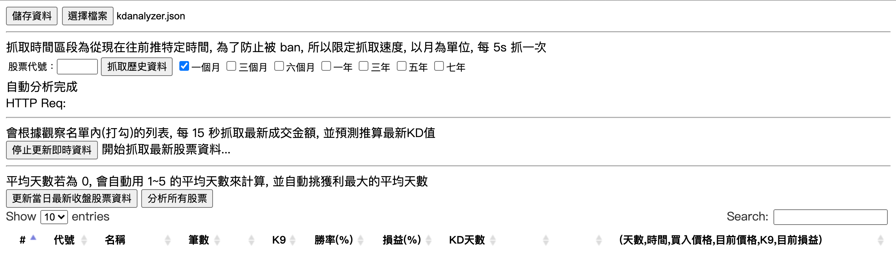
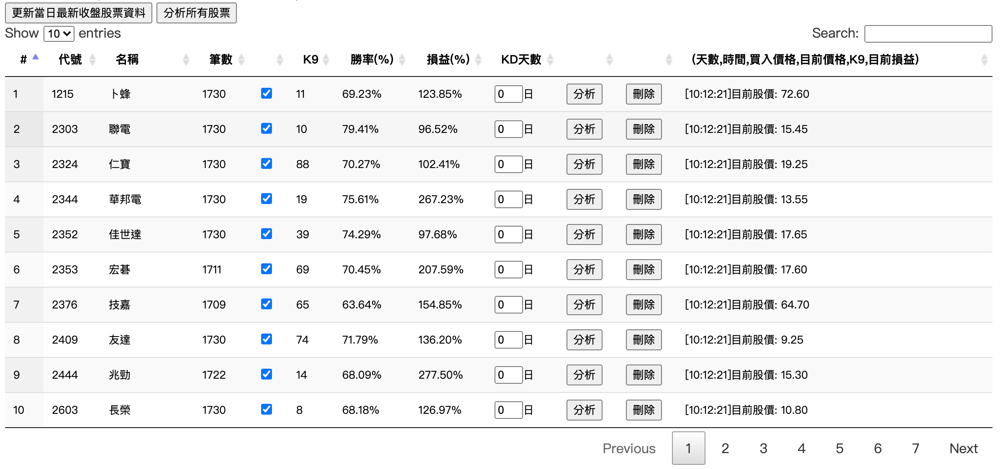

# KDAnalyzer
## How to install
- Install node.js (https://nodejs.org/zh-tw/download/)
- Clone this project
- npm install
## How to execute
- npm start
## Description

- 儲存資料：把既有的股票資料儲存
- 選擇檔案：載入之前所存放的股票資料，載入之後並不會把既存的取代，而是會合併
- 股票代號：指定要抓取的股票代號，並選擇所要抓的歷史資料時間
- 分析：根據股票資料，繪製股價/KD線圖，並自動根據KD模擬投資效益
- 刪除：把指定的股票資料刪除

